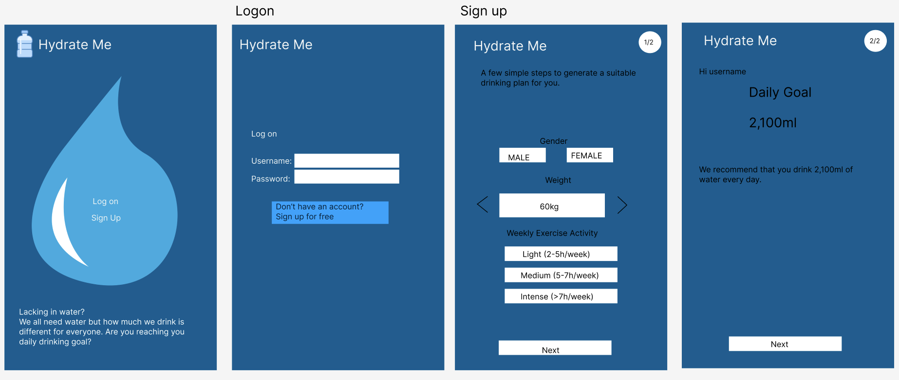
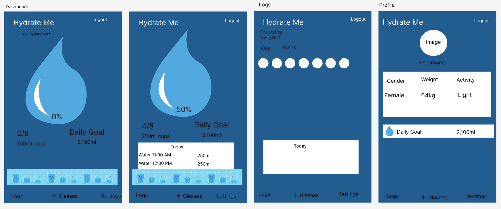
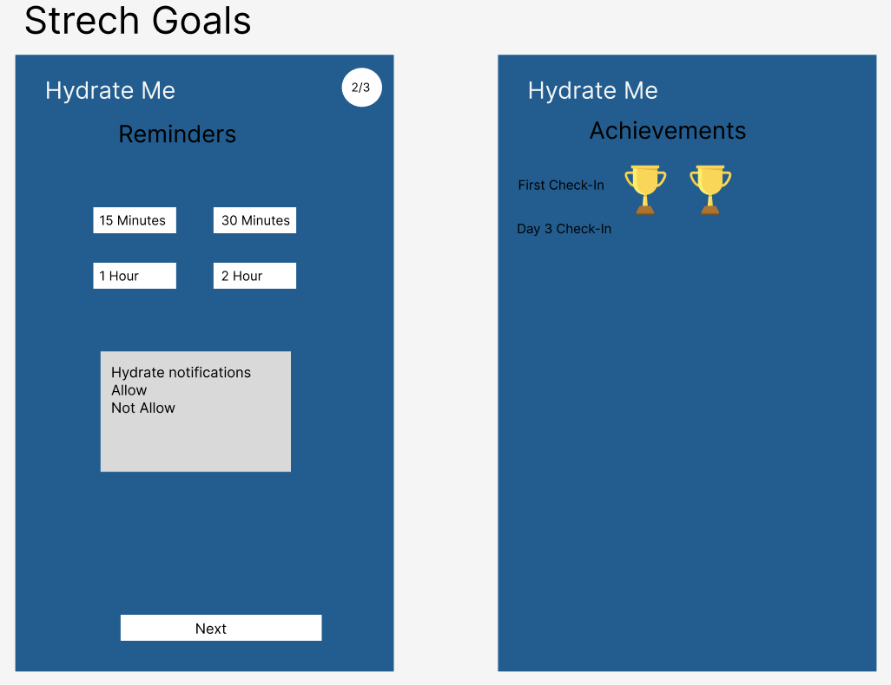
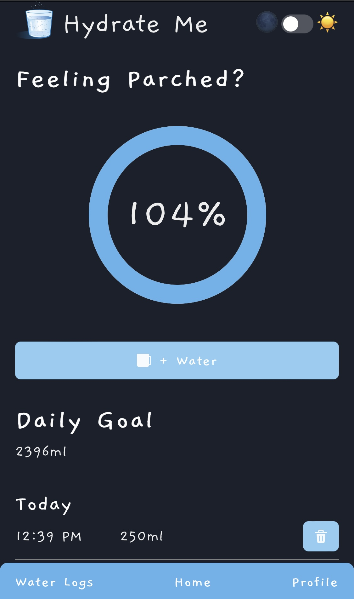
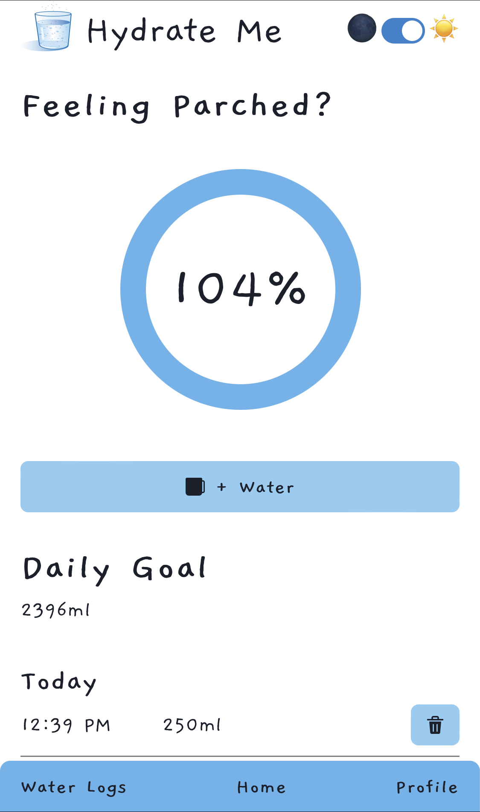

# Hydrate Me

This app is created for those who don't drink enough water. Everyone thinks 8 cups/2 Litres a day is enough but that's not true.
For people who work in the office or home, or for people who gym daily and don't drink enough water. Did you know you are meant to drink more water if you sweat a lot? Designed to generate the correct amount of water you need to take daily.

#### Heroku: [App](https://hydrate-me-ui.herokuapp.com/)

Demo account:

```
Username: demo
Password: demo
```

Project 4 [Brief](brief.md)

## Tech used:

- React
- Javascript
- HTML
- Mongoose
- Node.js
- Express

Third-party library components, including:

- [Chakra-ui](https://chakra-ui.com/getting-started)
- [Date FNS date/time parsing](https://date-fns.org/docs/Getting-Started)
- [Icons from React Icons](https://react-icons.github.io/react-icons/)
- [Fonts from Google Fonts](https://fonts.google.com/specimen/Gaegu?query=gaegu)

## Approach

1. Looked at other water tracking apps to get inspiration
2. Created wireframes using Figma
3. Design the database according to the wireframes
4. Set up the front end and back end
5. Mobile Only

### Wireframes




## Future Updates

- Ability to have notification, to remind users to drink water every hour.
- Ability to check to previous water logs from other days and get an average for the week.
- To have achievements to show the user has reached their daily drinking goal for a certain amount of days.



## Mobile App - Dark and Light Mode


